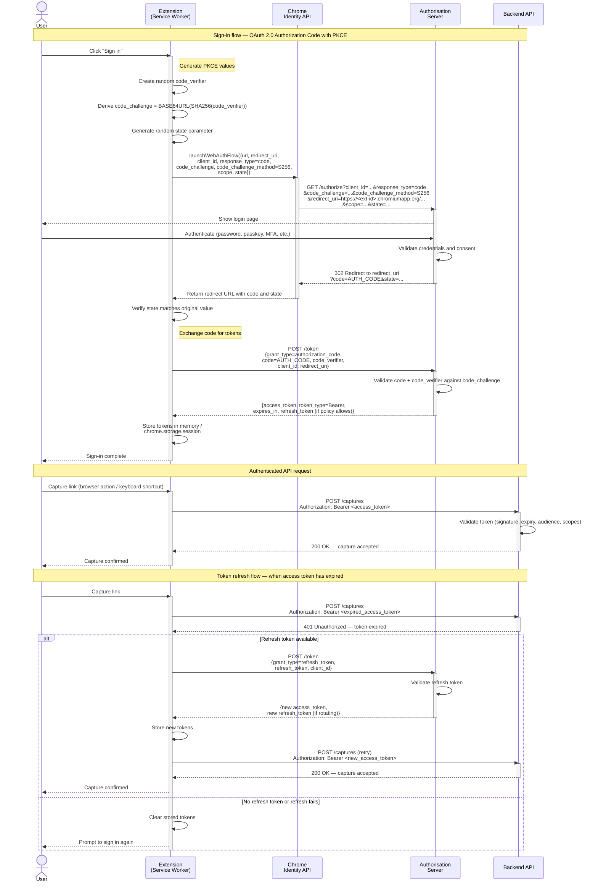

# ADR-002: Extension API Authentication

> |              |                                                            |
> | ------------ | ---------------------------------------------------------- |
> | Date         | `2026-03-20`                                               |
> | Status       | `Accepted`                                                 |
> | Significance | `Security & privacy, Interfaces & contracts, Architecture` |

---

- [ADR-002: Extension API Authentication](#adr-002-extension-api-authentication)
  - [Context 🧭](#context-)
  - [Decision ✅](#decision-)
    - [Assumptions 🧩](#assumptions-)
    - [Drivers 🎯](#drivers-)
    - [Options 🔀](#options-)
      - [Option A: OAuth 2.0 Authorization Code with PKCE using browser-mediated flow and bearer access tokens (Selected) ✅](#option-a-oauth-20-authorization-code-with-pkce-using-browser-mediated-flow-and-bearer-access-tokens-selected-)
      - [Option B: Static API key or embedded shared client secret in the extension](#option-b-static-api-key-or-embedded-shared-client-secret-in-the-extension)
      - [Option C: Cookie-backed session with extension-hosted or embedded login flow](#option-c-cookie-backed-session-with-extension-hosted-or-embedded-login-flow)
    - [Outcome 🏁](#outcome-)
    - [Authentication flow 🔄](#authentication-flow-)
    - [Rationale 🧠](#rationale-)
  - [Consequences ⚖️](#consequences-️)
  - [Compliance 📏](#compliance-)
  - [Notes 🔗](#notes-)
  - [Actions ✅](#actions-)
  - [Tags 🏷️](#tags-️)

## Context 🧭

The Link Capture Browser Extension needs a secure and practical way to authenticate against the backend API.

The extension runs in Chrome Manifest V3 and is distributed to multiple users. That means it cannot safely hold a confidential client secret. The chosen authentication approach must work with extension host permissions, support cross-origin API requests from the service worker, and avoid asking users to type credentials directly into the extension.

Research and implementation guidance showed the following:

- Chrome extensions can use the Chrome Identity API, including `chrome.identity.launchWebAuthFlow()`, to perform browser-mediated authentication flows with external identity providers.
- Cross-origin API calls from the extension service worker are supported when the extension declares the required `host_permissions`.
- OAuth best practice for native and public clients is Authorization Code Flow with PKCE, using an external user-agent rather than an embedded credential collection flow.
- Public clients must not rely on embedded client secrets or long-lived shared API keys as proof of identity.

This decision relates to the PRD authentication requirements in [../prd.md](../prd.md).

## Decision ✅

### Assumptions 🧩

- The backend platform can rely on an OAuth 2.0 or OpenID Connect compatible authorization server.
- The extension will be registered as a public client.
- API calls will be made over HTTPS.
- The extension may need to renew access after access token expiry, but the backend security policy controls whether refresh tokens are allowed.

### Drivers 🎯

- Use a standards-based authentication mechanism suitable for a distributed public client.
- Avoid putting credentials or secrets into the extension package.
- Preserve a good user experience by reusing the browser for authentication.
- Keep the implementation compatible with Chrome extension APIs and host permission rules.
- Support deterministic testing and mock authentication scenarios.

### Options 🔀

Scoring method: weighted score = `sum(weight * score) / sum(weights)`, where higher is better. The highest weights are given to security posture and platform fit because those are the main constraints for a Chrome extension calling a protected API.

#### Option A: OAuth 2.0 Authorization Code with PKCE using browser-mediated flow and bearer access tokens (Selected) ✅

**Top criteria**: Security posture, platform fit

**Weighted option score**: `4.67 / 5.00`

This option treats the extension as a public client, starts sign-in in the browser through Chrome Identity API support, exchanges the authorization code with PKCE, and sends short-lived bearer access tokens to the API.

| Criteria                | Weight | Score/Notes                                                                                                      |
| ----------------------- | ------ | ---------------------------------------------------------------------------------------------------------------- |
| Security posture        | 5      | ⭐⭐⭐⭐⭐ No embedded secret, no password collection in extension UI, and PKCE protects the authorization code. |
| Platform fit            | 5      | ⭐⭐⭐⭐⭐ Works with Chrome Identity API support and extension service worker requests.                         |
| User experience         | 4      | ⭐⭐⭐⭐ Reuses browser sign-in context and avoids custom login handling inside the extension.                   |
| Operability and testing | 3      | ⭐⭐⭐⭐ Easy to mock token presence, expiry, and scope failures.                                                |
| Effort                  | 2      | ⭐⭐⭐ Moderate implementation effort because redirect handling and token lifecycle must be built.               |
| Total score             | -      | `4.67 / 5.00`                                                                                                    |

#### Option B: Static API key or embedded shared client secret in the extension

**Top criteria**: Security posture, platform fit

**Weighted option score**: `1.92 / 5.00`

This option would embed a shared secret or API key in the extension package and use it to authenticate API requests.

| Criteria                | Weight | Score/Notes                                                                          |
| ----------------------- | ------ | ------------------------------------------------------------------------------------ |
| Security posture        | 5      | ⭐ Secrets distributed to all extension installs are not confidential.               |
| Platform fit            | 5      | ⭐⭐ Easy to implement technically, but poor fit for a public client security model. |
| User experience         | 4      | ⭐⭐⭐⭐⭐ Minimal user friction because there is no user sign-in flow.              |
| Operability and testing | 3      | ⭐⭐⭐ Easy to test, but revocation and rotation are awkward.                        |
| Effort                  | 2      | ⭐⭐⭐⭐⭐ Lowest implementation effort.                                             |
| Total score             | -      | `1.92 / 5.00`                                                                        |

**Why not chosen**: It does not provide credible client authentication for a distributed extension and creates unacceptable secret-exposure risk.

#### Option C: Cookie-backed session with extension-hosted or embedded login flow

**Top criteria**: Security posture, platform fit

**Weighted option score**: `2.58 / 5.00`

This option relies on establishing an authenticated web session and reusing cookies for API calls, typically with a login UI controlled by the extension.

| Criteria                | Weight | Score/Notes                                                                                                                     |
| ----------------------- | ------ | ------------------------------------------------------------------------------------------------------------------------------- |
| Security posture        | 5      | ⭐⭐ Better than embedded static secrets, but weaker if the extension collects credentials directly or uses embedded web views. |
| Platform fit            | 5      | ⭐⭐ Cross-origin cookie behaviour from an extension origin is awkward and less explicit than bearer token usage.               |
| User experience         | 4      | ⭐⭐⭐ Potentially familiar, but brittle across environments and browser privacy settings.                                      |
| Operability and testing | 3      | ⭐⭐⭐ Session expiry and cookie policy issues complicate testing and troubleshooting.                                          |
| Effort                  | 2      | ⭐⭐⭐ Medium effort with additional edge cases.                                                                                |
| Total score             | -      | `2.58 / 5.00`                                                                                                                   |

**Why not chosen**: It is less explicit, harder to reason about across extension and browser security boundaries, and more likely to drift into unsafe embedded credential handling.

### Outcome 🏁

Adopt Option A.

The extension shall authenticate to the backend API using OAuth 2.0 Authorization Code Flow with PKCE, with these rules:

- The extension is registered as a public client.
- The authorization flow is initiated in a browser-mediated context using Chrome Identity API support.
- The extension sends API requests with `Authorization: Bearer <access-token>` over HTTPS.
- The extension does not embed a client secret or long-lived shared API key.
- The default first-release authorization server shall be Keycloak, with separate realms and public client registrations for `local`, `non-production`, and `production`.
- The authorization server shall issue rotating refresh tokens with bounded lifetime for `non-production` and `production`, and the extension shall require re-authentication whenever refresh is unavailable or fails.
- Refresh tokens must be rotating, bounded in lifetime, revocable, and handled with minimal persistence.

This decision is reversible if the backend security model changes materially or if a different platform-supported authentication pattern becomes necessary.

### Authentication flow 🔄

The diagram below describes the full OAuth 2.0 Authorization Code Flow with PKCE as it applies to the Chrome extension, from user-initiated sign-in through to authenticated API calls and token renewal.

**Participants**:

- **User** — the person using the browser extension.
- **Extension (Service Worker)** — the Manifest V3 background service worker that orchestrates authentication and API communication.
- **Chrome Identity API** — the browser-provided `chrome.identity` interface that mediates the browser-based authorisation flow and manages the redirect URI.
- **Authorization Server** — the external OAuth 2.0 / OpenID Connect provider that authenticates the user and issues tokens.
- **Backend API** — the protected REST API that the extension sends captured link data to.

**Flow description**:

1. **Sign-in initiation** — the user triggers authentication, for example by clicking a "Sign in" button in the extension popup. The service worker begins the PKCE preparation.
2. **PKCE code verifier and challenge generation** — the service worker generates a cryptographically random `code_verifier` (a high-entropy string) and derives a `code_challenge` from it using the S256 method (`BASE64URL(SHA256(code_verifier))`). The `code_verifier` is held in memory and never transmitted to the authorisation server.
3. **Browser-mediated authorisation request** — the service worker calls `chrome.identity.launchWebAuthFlow()` with the authorisation URL, which includes the `client_id`, `redirect_uri` (the extension's `https://<extension-id>.chromiumapp.org/*` URL), `response_type=code`, `code_challenge`, `code_challenge_method=S256`, requested `scope`, and a `state` parameter for CSRF protection.
4. **User authentication** — Chrome opens a browser tab or popup directed at the authorisation server's login page. The user authenticates using whatever method the provider supports (password, passkey, SSO, MFA).
5. **Authorisation code redirect** — after successful authentication and consent, the authorisation server redirects the browser to the extension's registered redirect URI with an `authorization_code` and the `state` parameter.
6. **Redirect interception** — the Chrome Identity API intercepts the redirect to the `chromiumapp.org` URI and returns the full redirect URL (including the authorisation code) to the service worker callback.
7. **State validation** — the service worker verifies that the returned `state` matches the value it sent in step 3 to guard against CSRF attacks.
8. **Token exchange** — the service worker sends a POST request directly to the authorisation server's token endpoint, providing the `authorization_code`, the original `code_verifier`, the `client_id`, `redirect_uri`, and `grant_type=authorization_code`. Because the extension is a public client, no `client_secret` is included.
9. **Token response** — the authorisation server validates the code and the PKCE `code_verifier` against the previously received `code_challenge`. If valid, it returns a short-lived `access_token` and, if the server policy permits, a `refresh_token`.
10. **Token storage** — the service worker stores the tokens in memory (or `chrome.storage.session` for service-worker lifecycle resilience). Tokens are never written to `chrome.storage.local` or `chrome.storage.sync` to limit persistence and exposure.
11. **Authenticated API request** — for each API call the service worker attaches the access token as `Authorization: Bearer <access_token>` over HTTPS.
12. **API response** — the backend API validates the bearer token (signature, expiry, audience, scopes) and returns the response. If the token is invalid or expired, the API responds with `401 Unauthorized`.
13. **Token refresh (when access token expires)** — if the API returns `401` and a refresh token is available, the service worker sends a token refresh request to the authorisation server's token endpoint with `grant_type=refresh_token` and the current `refresh_token`. The authorisation server returns a new `access_token` and, if rotating refresh tokens are enabled, a new `refresh_token`. The service worker retries the original API request with the new access token.
14. **Re-authentication (when refresh is unavailable or fails)** — if no refresh token exists, or the refresh request fails (for example because the refresh token has been revoked or has expired), the service worker clears all stored tokens and prompts the user to sign in again by repeating the flow from step 1.



### Rationale 🧠

Option A best matches both the Chrome extension platform and OAuth security guidance for public clients.

- It uses standards the backend and identity provider are likely to support already.
- It avoids pretending that a distributed extension can keep a secret.
- It lets the browser handle authentication rather than teaching users to trust credential entry inside an extension UI.
- It makes API authentication explicit through bearer tokens and therefore easier to inspect, mock, and test.

## Consequences ⚖️

- The extension will need Chrome Identity API integration and redirect URI registration.
- The manifest will need the `identity` permission and environment-specific auth configuration.
- The mock environment must simulate authenticated, unauthenticated, expired-token, and insufficient-scope responses.
- The team still needs a follow-up decision on the exact scopes for each environment.

This decision no longer applies if the backend stops using user-scoped API authorization, or if the platform shifts to a materially different supported authentication mechanism.

## Compliance 📏

Compliance is met when:

- The PRD requires OAuth 2.0 Authorization Code Flow with PKCE for API authentication.
- The PRD and future implementation artefacts prohibit embedded client secrets and long-lived shared API keys.
- Mock and automated tests cover success, missing-token, expired-token, and insufficient-scope cases.

Validation approach:

- Run in local development and CI.
- Check the PRD, authentication configuration, and future tests for consistency with this ADR.
- Produce evidence through lint output and authentication-related test cases.

Local command:

```bash
rg -n "Authorization Code Flow|PKCE|client secret|shared API key|Authorization: Bearer|identity" docs/prd.md docs/adr/ADR-002_Extension_API_Authentication.md && make lint
```

## Notes 🔗

- Product requirements: [../prd.md](../prd.md)
- Related ADR: [ADR-001_Link_Capture_Payload_Contract.md](./ADR-001_Link_Capture_Payload_Contract.md)
- Template used: [ADR-nnn_Any_Decision_Record_Template.md](./ADR-nnn_Any_Decision_Record_Template.md)
- Reference guidance: [Tech_Radar.md](./Tech_Radar.md)

## Actions ✅

- [x] Dan, 2026-03-20, make API authentication an explicit PRD requirement
- [x] Dan, 2026-03-20, select Keycloak as the default identity provider for each environment, with separate realms and client registrations
- [ ] Dan, TBD, define the exact scopes for each environment
- [x] Dan, 2026-03-20, define the refresh token policy for the extension

## Tags 🏷️

`#security|#privacy|#interoperability|#compatibility|#operability|#testability|#maintainability`
