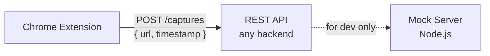
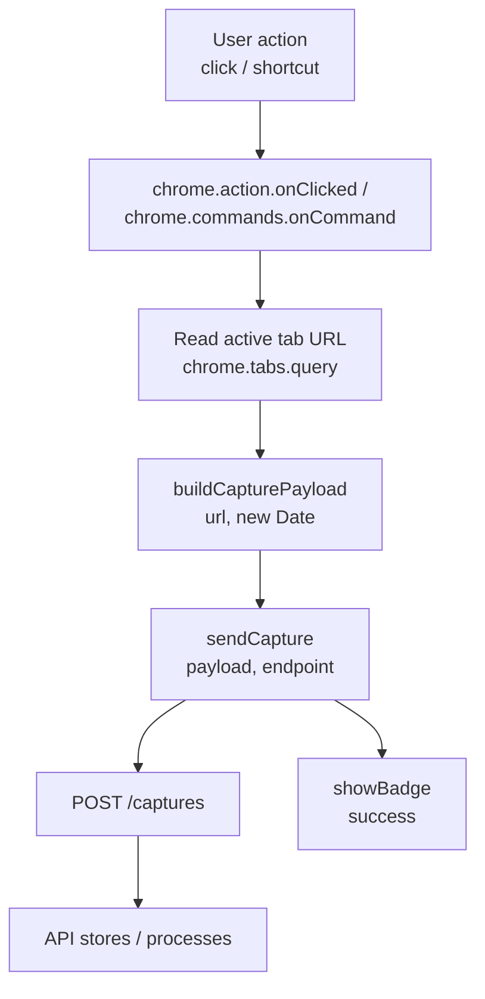

# Architecture Overview

## System context

The Link Capture Browser Extension is a Chrome Manifest V3 extension that captures the active tab URL and an ISO 8601 timestamp, then sends the data to an external REST API. A companion mock server is included for local development.

## Components

### Chrome extension (`src/extension/`)

A Manifest V3 service worker that:

1. Listens for toolbar icon clicks (`chrome.action.onClicked`) and keyboard shortcuts (`chrome.commands.onCommand`).
2. Reads the active tab URL from the Chrome Tabs API.
3. Builds a `CapturePayload` containing the URL and current ISO 8601 timestamp.
4. Sends the payload as a JSON POST request to the configured endpoint.
5. Displays brief badge feedback (green tick or red cross) for 2 seconds.

**Key modules:**

- **background.ts** — Service worker entry point. Contains `buildCapturePayload`, `sendCapture`, `showBadge`, and event listener wiring.
- **types.ts** — Shared `CapturePayload` interface and validation functions (`isCapturePayload`, `isValidUrl`, `isValidIso8601`).
- **config.ts** — Default endpoint configuration and URL validation.
- **manifest.json** — Chrome extension manifest defining permissions, commands, and service worker entry point.

### Mock server (`src/mock-server/`)

A plain Node.js HTTP server (no external framework) for development and testing:

- **POST /captures** — Validates and stores the payload in memory, returns `201 Created`.
- **GET /captures** — Returns all stored captures as a JSON array.

**Key modules:**

- **server.ts** — HTTP server creation, request routing, and CORS handling.
- **store.ts** — In-memory capture storage with `add`, `getAll`, and `clear` operations.

## Data flow

## Design decisions

- **No external framework for the mock server.** The built-in Node.js `http` module keeps the dev dependency footprint minimal for a simple two-route server.
- **Badge feedback over notifications.** Simpler, less intrusive, and requires no extra permissions.
- **ESM throughout.** Both extension and mock server use ES modules (`"type": "module"` in `package.json`, `NodeNext` module resolution).
- **Dependency injection for testability.** `sendCapture` accepts a `fetchFn` parameter; `showBadge` accepts a `BadgeApi` and `setTimeoutFn` — enabling deterministic unit tests without mocking globals.
- **Chrome Manifest V3.** Required by Chrome's extension platform; uses a service worker instead of a background page.

## Test strategy

Tests are organised into three tiers:

| Tier        | Location             | Purpose                                     |
| ----------- | -------------------- | ------------------------------------------- |
| Unit        | `tests/unit/`        | Individual functions in isolation           |
| Integration | `tests/integration/` | Extension ↔ mock server interaction         |
| Contract    | `tests/contract/`    | API request/response shape and status codes |

All tests run with [Vitest](https://vitest.dev/). Property-based tests use [fast-check](https://github.com/dubzzz/fast-check).

## Technology stack

| Concern              | Tool                |
| -------------------- | ------------------- |
| Language             | TypeScript (strict) |
| Runtime              | Node.js 22 LTS      |
| Package manager      | pnpm                |
| Linting / formatting | Biome               |
| Type checking        | tsc                 |
| Testing              | Vitest + fast-check |
| Extension platform   | Chrome Manifest V3  |

See the [Tech Radar](../adr/Tech_Radar.md) for the full mandated tooling list.
